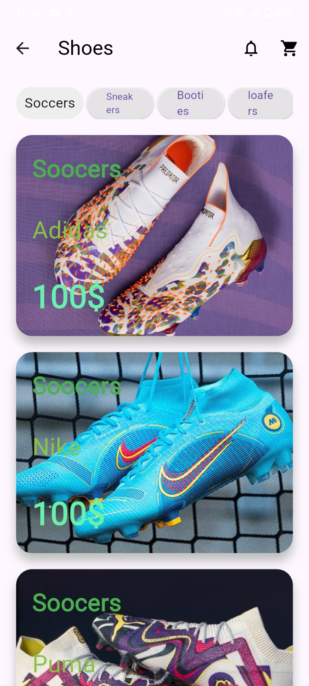
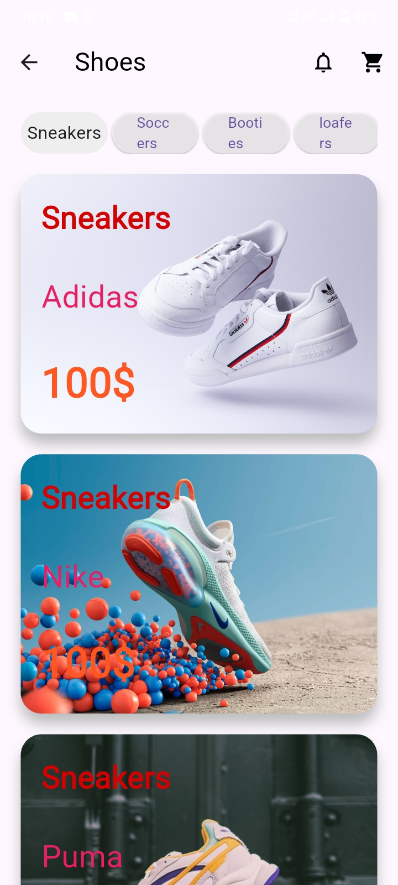
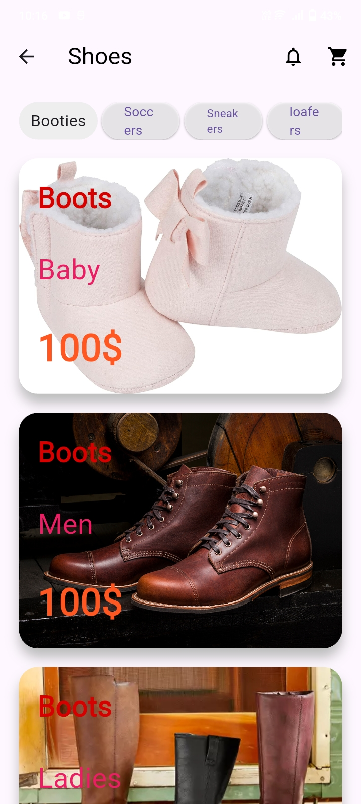
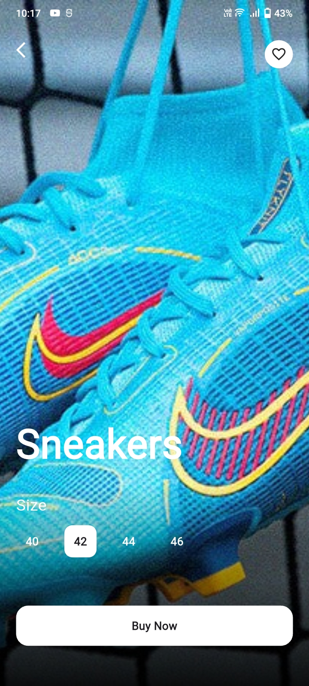
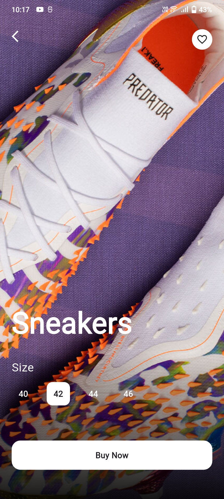
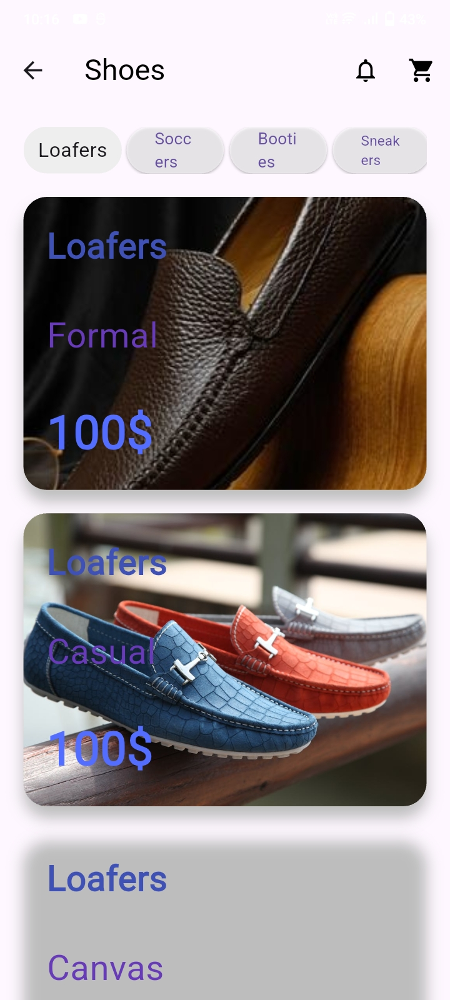

# E-Commerce Shoes App  

[](https://flutter.dev)  
[](https://dart.dev)  
[](LICENSE)  
[](https://github.com/rajgupta321/E-Commerce-Shoes-App/stargazers)  
[](https://github.com/rajgupta321/E-Commerce-Shoes-App/network/members)  

A Flutter-based mobile and web application designed for showcasing shoes in a clean and modern shopping interface. The project focuses on UI/UX and animations using Flutter’s core features.  

---
## 📸 Screenshots

<table>
<tr>
<td></td>
<td></td>
<td></td>
<td></td>
<td></td>
<td></td>
</tr>
</table>

---

## ✨ Features

- Beautiful UI for browsing shoes  
- Product detail screens (with images, description, price)  
- Smooth animations using **animate_do** package  
- Responsive design that runs on Android, iOS, and Web (default Flutter platform support)  

---

## 🛠️ Tech Stack

- **Framework**: Flutter  
- **Language**: Dart  
- **Animations**: [animate_do](https://pub.dev/packages/animate_do)  
- **Icons**: Cupertino Icons  
- **Assets**: Custom images inside `assets/images/`  

---

## 🚀 Setup & Installation

1. Clone this repository:
   ```bash
   git clone https://github.com/rajgupta321/E-Commerce-Shoes-App.git
   cd E-Commerce-Shoes-App
2. Install dependencies:
   ```bash
  flutter pub get
1. Run the app:
   ```bash
  flutter run
   To run on web:
   ```bash
   flutter run -d chrome

---

## 🤝 Contributing
1. Contributions are welcome!
2. Fork the repo
3. Create a new branch (feature/your-feature-name)
4. Commit your changes with clear messages
5. Push to your branch and create a Pull Request

---

## ⚠️ Known Issues
1. Payment/checkout flow not yet implemented
2. Some layouts may require further responsiveness adjustments

---

## 🔮 Future Enhancements
1. Backend integration (authentication, product database, payments)
2. Advanced product filtering and search
3. Dark mode support
4. Push notifications for offers and updates

---

## 📄 License
This project is licensed under the MIT License – see the LICENSE file for details.

---

## 📬 Contact
1. Author: Raj Gupta  
2. GitHub: [rajgupta321](https://github.com/rajgupta321)  
3. Email: officialrajgupta12@gmail.com
